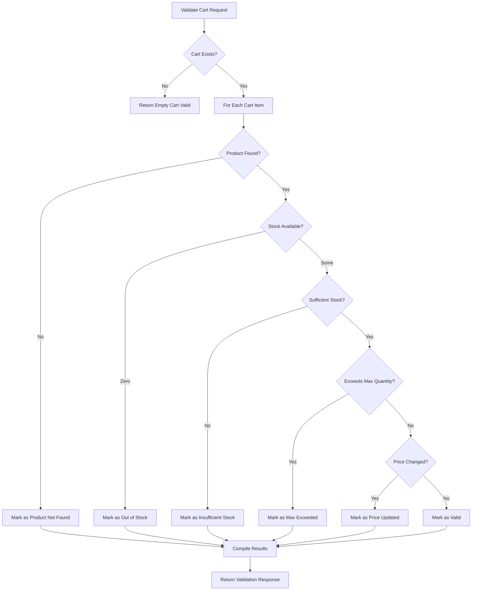

# Cart API Documentation

## Table of Contents
1. [Overview](#overview)
2. [Cart Data Model](#cart-data-model)
3. [API Endpoints](#api-endpoints)
4. [Cart Validation Logic](#cart-validation-logic)
5. [Response Structures](#response-structures)
6. [Frontend Integration Guide](#frontend-integration-guide)
7. [Auto-Fix Feature](#auto-fix-feature)
8. [Error Handling](#error-handling)

---

## Overview

The Cart API provides a comprehensive solution for managing shopping carts in an e-commerce application. It handles:

- ✅ **Cart Management**: Add, update, retrieve, and clear cart items
- ✅ **Real-time Validation**: Validate cart against current product data, stock, and prices
- ✅ **Auto-Fix Capability**: Automatically resolve cart issues when possible
- ✅ **Detailed Responses**: Comprehensive product data and actionable suggestions
- ✅ **Authentication**: Secure JWT-based user authentication

**Base URL**: `/api/cart`

**Authentication**: All endpoints (except GET `/`) require JWT token in Authorization header

---

## Cart Data Model

### Cart Schema

```javascript
{
  mobile_no: String,        // User's mobile number (unique identifier)
  store_code: String,       // Store identifier (e.g., "AVB")
  project_code: String,     // Project identifier (e.g., "PROJ001")
  items: [CartItem],        // Array of cart items
  subtotal: Number,         // Total price of all items
  total_items: Number,      // Count of distinct items
  total_quantity: Number,   // Sum of all item quantities
  last_updated: Date        // Last modification timestamp
}
```

### Cart Item Schema

```javascript
{
  p_code: String,           // Product code (required)
  product_name: String,     // Product name (required)
  quantity: Number,         // Item quantity (min: 1)
  unit_price: Number,       // Price per unit (min: 0)
  total_price: Number,      // quantity × unit_price
  package_size: Number,     // Package size (e.g., 250)
  package_unit: String,     // Unit of measurement (e.g., "GM", "ML")
  brand_name: String,       // Brand name
  pcode_img: String,        // Product image URL
  store_code: String        // Store code (required)
}
```

### Automatic Calculations

The Cart model automatically calculates the following on save:
- `subtotal`: Sum of all `item.total_price`
- `total_items`: Count of items in array
- `total_quantity`: Sum of all `item.quantity`
- `last_updated`: Current timestamp

---

## API Endpoints

### 1. Save/Update Cart

**Endpoint**: `POST /api/cart/save-cart`

**Description**: Save or update user's entire cart with all items. This is typically used when syncing the full cart state.

**Authentication**: Required (JWT token)

**Request Body**:
```json
{
  "store_code": "AVB",
  "project_code": "PROJ001",
  "items": [
    {
      "p_code": "2390",
      "product_name": "SABUDANA 250 (N.W.)",
      "quantity": 2,
      "unit_price": 18,
      "total_price": 36,
      "package_size": 250,
      "package_unit": "GM",
      "brand_name": "INDIAN CHASKA",
      "pcode_img": "https://example.com/image.jpg",
      "store_code": "AVB"
    }
  ]
}
```

**Validation**:
- ✅ `store_code` is required and non-empty
- ✅ `project_code` is required and non-empty
- ✅ `items` must be a non-empty array
- ✅ Each item must have: `p_code`, `product_name`, `quantity`, `unit_price`
- ✅ `quantity` must be ≥ 1
- ✅ `unit_price` must be ≥ 0
- ✅ `total_price` is auto-calculated as `quantity × unit_price`

**Success Response** (200):
```json
{
  "success": true,
  "message": "Cart saved successfully",
  "store_code": "AVB",
  "project_code": "PROJ001",
  "data": {
    "mobile_no": "9876543210",
    "items_count": 1,
    "total_quantity": 2,
    "subtotal": 36,
    "items": [...],
    "last_updated": "2026-01-24T16:12:30.000Z"
  }
}
```

**Error Response** (400):
```json
{
  "success": false,
  "error": "store_code is required"
}
```

---

### 2. Validate Cart

**Endpoint**: `POST /api/cart/validate-cart`

**Description**: Validate cart items against current product data, stock availability, and prices. Returns detailed validation results with actionable suggestions.

**Authentication**: Required (JWT token)

**Request Body**:
```json
{
  "store_code": "AVB",
  "project_code": "PROJ001",
  "autoFix": false  // Optional: auto-fix issues when true
}
```

**Validation Process**:

The validation checks each cart item against the ProductMaster collection:

1. **Product Existence**: Is the product still active?
2. **Price Changes**: Has the price changed?
3. **Stock Availability**: Is there enough stock?
4. **Max Quantity Limits**: Does quantity exceed maximum allowed?

**Success Response - Valid Cart** (200):
```json
{
  "success": true,
  "message": "Cart validation successful",
  "status": "valid",
  "store_code": "AVB",
  "project_code": "PROJ001",
  "mobile_no": "9876543210",
  "validation": {
    "valid": true,
    "totalItems": 2,
    "validItems": 2,
    "invalidItems": 0,
    "updatedItems": [],
    "invalidItems": [],
    "summary": {
      "hasPriceChanges": false,
      "hasStockIssues": false,
      "hasOutOfStock": false,
      "requiresAction": false
    }
  }
}
```

**Success Response - Price Changed** (200):
```json
{
  "success": true,
  "message": "1 product(s) have price changes",
  "status": "price_updated",
  "store_code": "AVB",
  "project_code": "PROJ001",
  "mobile_no": "9876543210",
  "validation": {
    "valid": true,
    "totalItems": 1,
    "validItems": 0,
    "invalidItems": 0,
    "updatedItems": [
      {
        "index": 0,
        "action": "update_price",
        "actionType": "price_changed",
        "message": "Price updated from ₹15 to ₹18",
        "p_code": "2390",
        "cartItem": { /* current cart item data */ },
        "product": { /* complete product data from database */ },
        "price": {
          "old": 15,
          "new": 18,
          "difference": 3,
          "percentageChange": "20.00"
        },
        "stock": {
          "available": 50,
          "requested": 2,
          "status": "available"
        },
        "suggestedAction": {
          "type": "update_price",
          "message": "Price has changed. Update cart with new price ₹18?",
          "newTotalPrice": 36,
          "options": [
            { "action": "update", "label": "Update price", "newPrice": 18 },
            { "action": "remove", "label": "Remove from cart" }
          ]
        }
      }
    ],
    "invalidItems": [],
    "summary": {
      "hasPriceChanges": true,
      "hasStockIssues": false,
      "hasOutOfStock": false,
      "requiresAction": true
    }
  }
}
```

**Success Response - Stock Issues** (200):
```json
{
  "success": true,
  "message": "1 product(s) out of stock",
  "status": "invalid",
  "store_code": "AVB",
  "project_code": "PROJ001",
  "mobile_no": "9876543210",
  "validation": {
    "valid": false,
    "totalItems": 1,
    "validItems": 0,
    "invalidItems": 1,
    "updatedItems": [],
    "invalidItems": [
      {
        "index": 0,
        "action": "update_quantity",
        "actionType": "out_of_stock",
        "message": "Product is out of stock",
        "p_code": "2390",
        "product_name": "SABUDANA 250 (N.W.)",
        "available_quantity": 0,
        "current_price": 18,
        "cartItem": { /* cart item data */ },
        "product": { /* product data */ },
        "stock": {
          "available": 0,
          "requested": 2,
          "status": "out_of_stock"
        },
        "price": {
          "old": 18,
          "new": 18,
          "changed": false
        },
        "suggestedAction": {
          "type": "update_quantity",
          "message": "This product is out of stock. Please remove it or wait for restock.",
          "options": [
            { "action": "remove", "label": "Remove from cart" },
            { "action": "keep", "label": "Keep for later (will notify when available)" }
          ]
        }
      }
    ],
    "summary": {
      "hasPriceChanges": false,
      "hasStockIssues": true,
      "hasOutOfStock": true,
      "requiresAction": true
    }
  }
}
```

---

### 3. Get Cart

**Endpoint**: `POST /api/cart/get-cart`

**Description**: Retrieve user's current cart with all items.

**Authentication**: Required (JWT token)

**Request Body**:
```json
{
  "store_code": "AVB",
  "project_code": "PROJ001"
}
```

**Success Response - Cart with Items** (200):
```json
{
  "success": true,
  "message": "Found 2 item(s) in cart",
  "store_code": "AVB",
  "project_code": "PROJ001",
  "mobile_no": "9876543210",
  "data": {
    "items": [...],
    "subtotal": 156.50,
    "total_items": 2,
    "total_quantity": 5,
    "last_updated": "2026-01-24T16:12:30.000Z"
  }
}
```

**Success Response - Empty Cart** (200):
```json
{
  "success": true,
  "message": "Cart is empty",
  "store_code": "AVB",
  "project_code": "PROJ001",
  "mobile_no": "9876543210",
  "data": {
    "items": [],
    "subtotal": 0,
    "total_items": 0,
    "total_quantity": 0,
    "last_updated": null
  }
}
```

---

### 4. Clear Cart

**Endpoint**: `POST /api/cart/clear-cart`

**Description**: Clear all items from user's cart. Typically called after successful order placement.

**Authentication**: Required (JWT token)

**Request Body**:
```json
{
  "store_code": "AVB",
  "project_code": "PROJ001"
}
```

**Success Response** (200):
```json
{
  "success": true,
  "message": "Cart cleared successfully",
  "store_code": "AVB",
  "project_code": "PROJ001",
  "mobile_no": "9876543210",
  "data": {
    "items": [],
    "subtotal": 0,
    "total_items": 0,
    "total_quantity": 0,
    "last_updated": "2026-01-24T16:15:00.000Z"
  }
}
```

---

### 5. Add Item to Cart

**Endpoint**: `POST /api/cart/add-item`

**Description**: Add a single item to cart or update if it already exists. Alternative to `save-cart` for incremental updates.

**Authentication**: Required (JWT token)

**Request Body**:
```json
{
  "store_code": "AVB",
  "project_code": "PROJ001",
  "p_code": "2390",
  "product_name": "SABUDANA 250 (N.W.)",
  "quantity": 2,
  "unit_price": 18,
  "package_size": 250,
  "package_unit": "GM",
  "brand_name": "INDIAN CHASKA",
  "pcode_img": "https://example.com/image.jpg"
}
```

**Validation**:
- ✅ All fields required except `package_size`, `package_unit`, `brand_name`, `pcode_img`
- ✅ `quantity` must be ≥ 1
- ✅ `unit_price` must be ≥ 0

**Success Response - New Item** (200):
```json
{
  "success": true,
  "message": "Item added to cart successfully",
  "store_code": "AVB",
  "project_code": "PROJ001",
  "data": {
    "mobile_no": "9876543210",
    "items_count": 3,
    "total_quantity": 7,
    "subtotal": 192.50,
    "added_item": {
      "p_code": "2390",
      "product_name": "SABUDANA 250 (N.W.)",
      "quantity": 2,
      "unit_price": 18,
      "total_price": 36
    }
  }
}
```

**Success Response - Updated Item** (200):
```json
{
  "success": true,
  "message": "Cart item updated successfully",
  "store_code": "AVB",
  "project_code": "PROJ001",
  "data": { /* same as new item */ }
}
```

---

### 6. Get All Carts (Testing)

**Endpoint**: `GET /api/cart`

**Description**: Retrieve all carts (for testing purposes only)

**Authentication**: Not required

**Success Response** (200):
```json
{
  "success": true,
  "count": 5,
  "message": "Found 5 cart(s)",
  "data": [
    {
      "mobile_no": "9876543210",
      "store_code": "AVB",
      "project_code": "PROJ001",
      "items_count": 2,
      "total_quantity": 5,
      "subtotal": 156.50,
      "last_updated": "2026-01-24T16:12:30.000Z",
      "items": [/* first 3 items only */]
    }
  ]
}
```

---

## Cart Validation Logic

### Validation Flow



### Validation Scenarios

#### 1. Product Not Found

**Condition**: Product doesn't exist in ProductMaster or `pcode_status != 'Y'`

**Response**:
```json
{
  "actionType": "product_not_found",
  "action": "remove",
  "message": "Product not found or inactive",
  "suggestedAction": {
    "type": "remove",
    "message": "This product is no longer available. Please remove it from your cart."
  }
}
```

**Frontend Action**: Remove item from cart

---

#### 2. Out of Stock

**Condition**: `product.store_quantity === 0`

**Response**:
```json
{
  "actionType": "out_of_stock",
  "action": "update_quantity",
  "available_quantity": 0,
  "stock": {
    "available": 0,
    "requested": 2,
    "status": "out_of_stock"
  },
  "suggestedAction": {
    "type": "update_quantity",
    "message": "This product is out of stock. Please remove it or wait for restock.",
    "options": [
      { "action": "remove", "label": "Remove from cart" },
      { "action": "keep", "label": "Keep for later" }
    ]
  }
}
```

**Frontend Action**: Show dialog, offer to remove or save for later

---

#### 3. Insufficient Stock

**Condition**: `product.store_quantity < cartItem.quantity`

**Response**:
```json
{
  "actionType": "insufficient_stock",
  "action": "update_quantity",
  "message": "Only 50 item(s) available. You requested 100.",
  "available_quantity": 50,
  "stock": {
    "available": 50,
    "requested": 100,
    "status": "insufficient",
    "maxAvailable": 50
  },
  "suggestedAction": {
    "type": "update_quantity",
    "message": "Only 50 item(s) available. Update quantity to 50?",
    "newQuantity": 50,
    "options": [
      { "action": "update", "label": "Update to 50", "quantity": 50 },
      { "action": "remove", "label": "Remove from cart" }
    ]
  }
}
```

**Frontend Action**: Auto-update to available quantity or show dialog

---

#### 4. Max Quantity Exceeded

**Condition**: `product.max_quantity_allowed && cartItem.quantity > product.max_quantity_allowed`

**Response**:
```json
{
  "actionType": "max_quantity_exceeded",
  "action": "update_quantity",
  "message": "Maximum 10 item(s) allowed per order. You requested 15.",
  "available_quantity": 10,
  "max_allowed": 10,
  "stock": {
    "available": 100,
    "requested": 15,
    "status": "available",
    "maxAllowed": 10
  },
  "suggestedAction": {
    "type": "update_quantity",
    "message": "Maximum 10 item(s) allowed. Update quantity to 10?",
    "newQuantity": 10,
    "options": [
      { "action": "update", "label": "Update to 10", "quantity": 10 },
      { "action": "remove", "label": "Remove from cart" }
    ]
  }
}
```

**Frontend Action**: Auto-update to max allowed or show dialog

---

#### 5. Price Changed

**Condition**: `product.our_price !== cartItem.unit_price`

**Response**:
```json
{
  "actionType": "price_changed",
  "action": "update_price",
  "message": "Price updated from ₹15 to ₹18",
  "price": {
    "old": 15,
    "new": 18,
    "difference": 3,
    "percentageChange": "20.00"
  },
  "stock": {
    "available": 50,
    "requested": 2,
    "status": "available"
  },
  "suggestedAction": {
    "type": "update_price",
    "message": "Price has changed. Update cart with new price ₹18?",
    "newTotalPrice": 36,
    "options": [
      { "action": "update", "label": "Update price", "newPrice": 18 },
      { "action": "remove", "label": "Remove from cart" }
    ]
  }
}
```

**Frontend Action**: Auto-update price and show notification

---

## Response Structures

### Product Data in Validation Response

All validation responses include complete product data for frontend use:

```json
{
  "product": {
    "p_code": "2390",
    "product_name": "SABUDANA 250 (N.W.)",
    "product_description": "Premium quality Sabudana",
    "package_size": 250,
    "package_unit": "GM",
    "product_mrp": 20,
    "our_price": 18,
    "brand_name": "INDIAN CHASKA",
    "store_code": "AVB",
    "pcode_status": "Y",
    "dept_id": 1,
    "category_id": 5,
    "sub_category_id": 12,
    "store_quantity": 50,
    "max_quantity_allowed": 10,
    "pcode_img": "https://example.com/image.jpg",
    "barcode": "1234567890"
  }
}
```

### Action Types Reference

| Action Type | Action | Severity | Frontend Behavior |
|------------|--------|----------|-------------------|
| `price_changed` | `update_price` | ⚠️ Warning | Auto-update price, show notification |
| `out_of_stock` | `update_quantity` | ❌ Error | Show dialog, offer remove/keep options |
| `insufficient_stock` | `update_quantity` | ❌ Error | Auto-update to available or show dialog |
| `max_quantity_exceeded` | `update_quantity` | ❌ Error | Auto-update to max or show dialog |
| `product_not_found` | `remove` | ❌ Error | Auto-remove from cart, show notification |

---

## Frontend Integration Guide

### Basic Workflow

```javascript
// 1. Add item to cart
async function addToCart(product, quantity) {
  const response = await fetch('/api/cart/add-item', {
    method: 'POST',
    headers: {
      'Authorization': `Bearer ${token}`,
      'Content-Type': 'application/json'
    },
    body: JSON.stringify({
      store_code: 'AVB',
      project_code: 'PROJ001',
      p_code: product.p_code,
      product_name: product.product_name,
      quantity: quantity,
      unit_price: product.our_price,
      package_size: product.package_size,
      package_unit: product.package_unit,
      brand_name: product.brand_name,
      pcode_img: product.pcode_img
    })
  });
  
  const data = await response.json();
  
  if (data.success) {
    updateCartBadge(data.data.items_count);
    showNotification(data.message);
  }
}

// 2. Get cart (on page load)
async function loadCart() {
  const response = await fetch('/api/cart/get-cart', {
    method: 'POST',
    headers: {
      'Authorization': `Bearer ${token}`,
      'Content-Type': 'application/json'
    },
    body: JSON.stringify({
      store_code: 'AVB',
      project_code: 'PROJ001'
    })
  });
  
  const data = await response.json();
  
  if (data.success) {
    renderCart(data.data.items);
    updateCartSummary(data.data);
  }
}

// 3. Validate cart (before checkout)
async function validateCart() {
  const response = await fetch('/api/cart/validate-cart', {
    method: 'POST',
    headers: {
      'Authorization': `Bearer ${token}`,
      'Content-Type': 'application/json'
    },
    body: JSON.stringify({
      store_code: 'AVB',
      project_code: 'PROJ001',
      autoFix: false
    })
  });
  
  const data = await response.json();
  
  if (data.success) {
    handleValidationResults(data.validation);
  }
}

// 4. Handle validation results
function handleValidationResults(validation) {
  // Check quick summary
  if (!validation.summary.requiresAction) {
    proceedToCheckout();
    return;
  }
  
  // Handle price changes
  if (validation.summary.hasPriceChanges) {
    validation.updatedItems.forEach(item => {
      updateItemPrice(item.index, item.price.new);
      showNotification(`${item.product.product_name}: ${item.message}`);
    });
  }
  
  // Handle stock issues
  if (validation.summary.hasStockIssues) {
    validation.invalidItems.forEach(item => {
      switch (item.actionType) {
        case 'out_of_stock':
          showOutOfStockDialog(item);
          break;
        case 'insufficient_stock':
          showInsufficientStockDialog(item);
          break;
        case 'max_quantity_exceeded':
          showMaxQuantityDialog(item);
          break;
        case 'product_not_found':
          removeItem(item.index);
          showNotification(`${item.product_name} is no longer available`);
          break;
      }
    });
  }
}

// 5. Clear cart (after order)
async function clearCart() {
  const response = await fetch('/api/cart/clear-cart', {
    method: 'POST',
    headers: {
      'Authorization': `Bearer ${token}`,
      'Content-Type': 'application/json'
    },
    body: JSON.stringify({
      store_code: 'AVB',
      project_code: 'PROJ001'
    })
  });
  
  const data = await response.json();
  
  if (data.success) {
    updateCartBadge(0);
    renderCart([]);
  }
}
```

### Recommended Validation Flow

```javascript
async function proceedToCheckoutWithValidation() {
  // Step 1: Validate cart
  const response = await fetch('/api/cart/validate-cart', {
    method: 'POST',
    headers: {
      'Authorization': `Bearer ${token}`,
      'Content-Type': 'application/json'
    },
    body: JSON.stringify({
      store_code: 'AVB',
      project_code: 'PROJ001',
      autoFix: true  // Enable auto-fix
    })
  });
  
  const data = await response.json();
  
  // Step 2: Check if auto-fix made changes
  if (data.fixed) {
    // Show summary of changes
    showCartChangesModal({
      title: 'Cart Updated',
      message: data.message,
      changes: data.changes,
      onConfirm: () => {
        // Reload cart with updated data
        loadCart();
      }
    });
    return;
  }
  
  // Step 3: Handle remaining issues
  if (!data.validation.valid) {
    showValidationErrorsModal(data.validation);
    return;
  }
  
  // Step 4: Cart is valid, proceed to checkout
  navigateToCheckout();
}
```

---

## Auto-Fix Feature

### Overview

The `autoFix` parameter enables automatic resolution of cart issues when possible.

### How It Works

When `autoFix: true` is passed to `/api/cart/validate-cart`:

1. **Validates** all cart items
2. **Automatically fixes** issues where possible:
   - **Price Changes**: Updates prices to current values
   - **Insufficient Stock**: Reduces quantity to available stock
   - **Max Quantity Exceeded**: Reduces quantity to maximum allowed
   - **Out of Stock**: Removes items
   - **Product Not Found**: Removes items
3. **Saves** the updated cart
4. **Returns** a summary of changes made

### Request

```json
{
  "store_code": "AVB",
  "project_code": "PROJ001",
  "autoFix": true
}
```

### Response (Auto-Fixed)

```json
{
  "success": true,
  "fixed": true,
  "message": "Cart automatically updated based on latest stock and prices",
  "changes": [
    {
      "type": "price",
      "item": "SABUDANA 250 (N.W.)",
      "from": 15,
      "to": 18
    },
    {
      "type": "quantity",
      "item": "RICE 1KG",
      "from": 100,
      "to": 50
    },
    {
      "type": "remove",
      "item": "WHEAT FLOUR",
      "reason": "Out of stock"
    }
  ],
  "store_code": "AVB",
  "project_code": "PROJ001",
  "mobile_no": "9876543210",
  "validation": {
    "valid": false,
    "fixed": true,
    "changes": [...]
  }
}
```

### Change Types

| Type | Description | Action Taken |
|------|-------------|--------------|
| `price` | Price was updated | Updated `unit_price` and `total_price` |
| `quantity` | Quantity was reduced | Updated `quantity` and `total_price` |
| `remove` | Item was removed | Removed from cart |

### Frontend Handling

```javascript
async function validateWithAutoFix() {
  const response = await fetch('/api/cart/validate-cart', {
    method: 'POST',
    headers: {
      'Authorization': `Bearer ${token}`,
      'Content-Type': 'application/json'
    },
    body: JSON.stringify({
      store_code: 'AVB',
      project_code: 'PROJ001',
      autoFix: true
    })
  });
  
  const data = await response.json();
  
  if (data.fixed) {
    // Show changes to user
    const changesSummary = data.changes.map(change => {
      switch (change.type) {
        case 'price':
          return `${change.item}: Price updated from ₹${change.from} to ₹${change.to}`;
        case 'quantity':
          return `${change.item}: Quantity reduced from ${change.from} to ${change.to}`;
        case 'remove':
          return `${change.item}: Removed - ${change.reason}`;
      }
    }).join('\n');
    
    showAlert({
      title: 'Cart Updated',
      message: changesSummary,
      confirmText: 'Continue to Checkout',
      onConfirm: () => {
        // Reload cart to reflect changes
        loadCart();
      }
    });
  } else if (data.validation.valid) {
    // Cart is valid, proceed
    proceedToCheckout();
  }
}
```

---

## Error Handling

### Common Error Responses

#### 400 Bad Request

**Missing Required Fields**:
```json
{
  "success": false,
  "error": "store_code is required"
}
```

**Invalid Item Data**:
```json
{
  "success": false,
  "error": "Item 1: quantity must be at least 1"
}
```

#### 401 Unauthorized

**Missing or Invalid Token**:
```json
{
  "success": false,
  "error": "Not authorized, token failed"
}
```

#### 500 Internal Server Error

**Database or Server Error**:
```json
{
  "success": false,
  "error": "Error message details"
}
```

### Frontend Error Handling

```javascript
async function safeApiCall(endpoint, options) {
  try {
    const response = await fetch(endpoint, options);
    const data = await response.json();
    
    if (!response.ok) {
      // Handle HTTP errors
      if (response.status === 401) {
        // Token expired, redirect to login
        redirectToLogin();
      } else if (response.status === 400) {
        // Show validation error
        showError(data.error);
      } else {
        // Show generic error
        showError('Something went wrong. Please try again.');
      }
      return null;
    }
    
    return data;
  } catch (error) {
    // Handle network errors
    showError('Network error. Please check your connection.');
    return null;
  }
}

// Usage
const data = await safeApiCall('/api/cart/get-cart', {
  method: 'POST',
  headers: {
    'Authorization': `Bearer ${token}`,
    'Content-Type': 'application/json'
  },
  body: JSON.stringify({
    store_code: 'AVB',
    project_code: 'PROJ001'
  })
});

if (data && data.success) {
  renderCart(data.data.items);
}
```

---

## Best Practices

### 1. Always Validate Before Checkout

```javascript
// ❌ Bad: Direct checkout
function checkout() {
  navigateToCheckoutPage();
}

// ✅ Good: Validate first
async function checkout() {
  const validation = await validateCart();
  if (validation && validation.validation.valid) {
    navigateToCheckoutPage();
  }
}
```

### 2. Use Auto-Fix for Better UX

```javascript
// ✅ Enable auto-fix to automatically resolve issues
await validateCart({ autoFix: true });
```

### 3. Update Cart on Price Changes

```javascript
// ✅ Auto-update prices when detected
if (item.actionType === 'price_changed') {
  updateItemPrice(item.index, item.price.new);
  showNotification(item.message);
}
```

### 4. Clear Cart After Successful Order

```javascript
// ✅ Always clear cart after order placement
async function placeOrder(orderData) {
  const orderResponse = await submitOrder(orderData);
  if (orderResponse.success) {
    await clearCart();
  }
}
```

### 5. Handle Validation Summary Flags

```javascript
// ✅ Use summary flags for quick checks
if (validation.summary.requiresAction) {
  // Show validation modal
  showValidationModal(validation);
} else {
  // Proceed directly
  proceedToCheckout();
}
```

---

## Testing

### Test Scripts

Run comprehensive validation tests:

```bash
# Test all scenarios
node test-validate-cart.js all

# Test specific scenario
node test-validate-cart.js 4  # Price changed scenario
```

### Available Test Scenarios

1. Empty Cart
2. Valid Cart
3. Product Not Found
4. Price Changed
5. Insufficient Stock
6. Max Quantity Exceeded
7. Multiple Issues
8. Missing Fields
9. Invalid Auth
10. Multiple Valid Items

See [QUICK_TEST_VALIDATE_CART.md](file:///Users/gauravpawar/Documents/Development/code/Shalvi/shalvi_web_Setup/EcommerceAPI_Web/QUICK_TEST_VALIDATE_CART.md) for detailed testing guide.

---

## Summary

The Cart API provides a robust solution for e-commerce cart management with:

✅ **Complete CRUD Operations**: Add, update, retrieve, clear  
✅ **Intelligent Validation**: Real-time checks against product data  
✅ **Auto-Fix Capability**: Automatic issue resolution  
✅ **Detailed Responses**: Complete product data and actionable suggestions  
✅ **Frontend-Friendly**: Easy integration with clear action types  
✅ **Secure**: JWT-based authentication  
✅ **Well-Tested**: Comprehensive test scenarios

For detailed validation response formats, see [VALIDATE_CART_RESPONSE_FORMAT.md](file:///Users/gauravpawar/Documents/Development/code/Shalvi/shalvi_web_Setup/EcommerceAPI_Web/VALIDATE_CART_RESPONSE_FORMAT.md).
